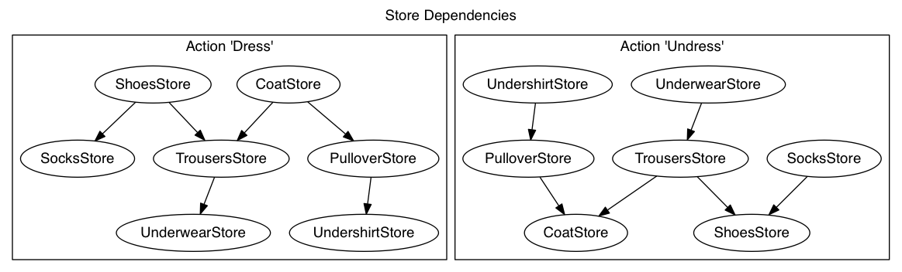

# Circuit

Circuit provides an unidirectional data flow model for GUI applications. It's intended to be used with GWT, but can be leveraged in any Java GUI framework. 

It resembles the ideas of the [Flux Architecture](http://facebook.github.io/react/docs/flux-overview.html) that can be found in the [React.js](http://facebook.github.io/react/index.html) framework, but adds certain semantics to the data flow model.

For a general introduction and problem statement we'd recommend to look at the Flux documentation first. The specifics of the Circuit implementation will be explained in the following sections.

## Core Components

### Data Flow Model

View components (presenters in this case) dispatch actions through central dispatcher. The dispatcher coordinates the processing of actions across stores. Stores process the data or state change associated with an action and emit change events once they are done. Interested parties (presenters) read the data of the store and update the views accordingly.

```
                                             Process(Action)
                      +-----------------+
                      |   Dispatcher    | +--------------+
                      |                 |                |
                      +-----------------+                |
                                                         |
                             ^                           v
                       Action|
+-----------+                |                   +----------+
|   View    |  Interaction   |       read        |  Store   |
|           | +----------+   |   +-------------> |          |
+-----------+            v   |   |               +----------+
                             |   |
    ^                 +------+---+------+                +
    |                 |    Presenter    |                |
    +---------------+ |                 |  <-------------+
           update     +-----------------+           Change Event

                           ^
                           |  Lifecycle
                       +---+------------+
                       |   Framework    |
                       |                |
                       +----------------+

```

### Actions
Actions represent behaviour, data and state within an application. They signal state changes to the dispatcher, which in turn coordinates the processing of actions across stores.

Actions are most often initiated from user interaction, but they are not limited to that. It's also possible that the underlying framework or the service backend creates and dispatches actions.

```java
@ActionType
public class SaveTodo implements org.jboss.gwt.circuit.Action<Todo> {
 	private final Todo todo;
	[...]
}
```

### Dispatcher
The dispatcher acts as a central hub for processing actions. Any action passes through the dispatcher and the dispatcher delegates it to the Stores, that do ultimately process the Action.

The Dispatchers main responsibility is to coordinate the processing of Actions across Stores. 

```java
public interface Dispatcher {

    <S> void register(Class<S> store, StoreCallback callback);

    void dispatch(Action action);
}
```

### Stores
Stores keep the application state and act as proxies to the data model used by an application. Most often stores interact with service backends to read and modify a persistent data model, which they in turn expose in a read-only fashion to the actual view (or presenter-view tuples in MVP).

Stores are registered with the Dispatcher for Actions they are interested in. They can directly rely on the data passed with an Action, or listen for state changes in other parts of the data model.

```java
public class TodoStore {

	private Todo selectedTodo;
	private final List<Todo> todos;

	@Process(actionType = SaveTodo.class)
	public void onSave(final Todo todo, final Dispatcher.Channel channel) {
		// persist the todo (backend call)
    }
}
```

### Presenter (as in MVP)

The Presenter (or presenter-view tuple as in MVP) creates and dispatches Actions. This happens on behalf of a user interaction, due to framework events or another signal from the service backend. 

Presenters listen to Store Change Events and in turn read data from Stores and update the views accordingly.

Presenters do only have read-only access to Stores and the data they maintain. Any modification to the data or state of an application has to be driven by Actions. 

```java
class TodoPresenter() {
	
	TodoStore todoStore;

	public TodoPresenter() {
		todoStore.addChangeHandler(
		    new PropagatesChange.Handler() {
  				@Override
    			public void onChange(Class<?> source) {
					// when the model changed, update the view
    				updateView(todoStore.getTodos());                     
 				}
  		});
	}
}
```

## Processing Semantics

One of the core problems Circuit addresses are cascading effects of event based applications. 

In a typical GUI application an event triggers some business logic, model update or state change, most often as a result of user interaction. Events can trigger other events, which leads to unpredictable data flow, hard to diagnose problems and unclear application semantics.

The guiding principal in Circuit (and Flux) is to provide a framework with deterministic behaviour that allows you to hook into the data flow at any point and know exactly what steps will be executed next.

The uni-directional data flow described above already provides a good baseline, but Circuit adds some specific semantics to the contract between the core components, which will be described in the next sections.

### Action Sequences

Any Action flows through the Dispatcher and the dispatcher coordinates how the Stores process the actions. In Circuit we use a sequencing dispatcher, that ensures only one Action will be processed at a time. 

If two Actions are dispatched simultaneously the later one will be queued. All Stores that are registered for a particular Action type will process the Action and once the group completes the next Action will be taken of the queue.

This way Actions don't create race conditions when updating the state or data of an application.

### Store Interdependencies

Typically a single Store maintains a particular segment of the data or domain model in an application and the relevant state associated with it. On most applications Stores don't exist in isolation, but depend on other model parts to perform their work.

Circuit allows you to express dependencies between Stores on the level of an Action type. 

```java
public class TodoStore {
    @Process(actionType = RemoveUser.class, dependencies = {UserStore.class})
    public void onRemoveUser(String user, final Dispatcher.Channel channel) {
		// when a user is removed we removes his todo's 
		[...]
    }
}
```

### Contract Between Store and Dispatcher

Stores are registered with a `StoreCallback` against the Dispatcher. This callback is the contract between the store and the dispatcher and consists of three phases: 

1. Prepare Action
1. Complete Action
1. Signal Change Event 

During the preparation phase Stores signal interest in a particular Action type and any dependencies they have on other Stores for a particular Action type. 

The Dispatcher creates a dependency graph for each action type and invoke the Stores in an ordered way, one at a time.

This way Stores can safely rely on the State of other Stores during the processing of an Action.

Upon completion Stores consume the Action and acknowledge successful processing. Finally Change Events are fired to signal interested parties that the data or state of the application has changed. Since Stores process the Action in an ordered way, the Change Events follow that pattern.

#### Action Acknowledgement

Many Store implementations rely on asynchronous invocations to the service backend. Circuit was build to provide support for asynchronous flow control in Stores.

When Stores complete the processing of an Action, they acknowledge the Action they processed. This signals the Dispatcher that the next Store can start processing the Action.

```java
public class TodoStore {

	@Process(actionType = SaveTodo.class)
	public void onSave(final Todo todo, final Dispatcher.Channel channel) {

		// async invocation
    	todoService.save(todo, new TodoCallback<Void>(channel) {
            @Override
            public void onSuccess(final Void result) {
				// acknowledgement
				channel.ack();
            }
        });
    }
}
```

#### Change Events

When an Action is acknowledged by a Store, the Dispatcher will fire a Change Event for that Store. However, this only happens *after* the Action was processed by all Stores. The order of Change Events follows the order in which the Action was processed by the Stores.

## Programming Model

Circuit provides a minimalistic API with a handful of interfaces and some reasonable default implementations. When it comes to implementation, Circuit tries to be as less intrusive as possible. The following section describes the API for the basic building blocks.

### API

#### Action

An action is defined by a class which implements the interface `org.jboss.gwt.circuit.Action<P>`, where `P` acts as the payload of the action. The payload is in most cases some kind of POJO which is processed by stores. However there might be cases where an action is more some kind of command without a payload at all.

#### Store

Stores do not need to implement a special interface. However they need to register with the Dispatcher for actions they are interested in. This registration is done by implementing the interface `org.jboss.gwt.circuit.StoreCallback`. The methods on this interface reflects the two phases (prepare and complete) as described above:

- `Agreement voteFor(Action action)` to express support for an action and optional dependencies to other stores and 
- `void complete(Action action, Dispatcher.Channel channel)` which is called when an action is dispatched to the store.

#### Dispatcher

The dispatcher interface mainly consists of two methods:

- `<S> void register(Class<S> store, StoreCallback callback)` to register a callback for a given store and
- `void dispatch(Action action)` to dispatch actions

While you are free to implement your own dispatcher, Circuit comes with a default implementation: `org.jboss.gwt.circuit.dag.DAGDispatcher`. The `DAGDispatcher` provides sequential action processing and takes care of inter-store dependencies as described above. 

To see an example on how to use the API in more detail, take a look at the [calculator](samples/calculator) example. 

### Annotation Based Approach

As an alternative to using the API directly and implementing all the bits and pieces manually, Circuit comes with a set of annotations and an APT processor which generates most of the boilerplate code for you. The annotations step in when it comes to write the code for the callback registration and declare store dependencies. 

The entrance ticket is the `@Store` annotation which must be placed on the store implementation:

```java
@Store
public class ShoesStore {
    [...]
}
```

A store implementation marked with `@Store` must contain one or more methods marked with `@Process`. This annotation tells Circuit what action type (and thus what payload) the method can process. Furthermore dependencies to other stores can be expressed using `@Process`: 

```java
@Store
public class ShoesStore {

    @Process(actionType = Dress.class, dependencies = {TrousersStore.class, SocksStore.class})
    public void dress(Dispatcher.Channel channel) {
        [...]
        channel.ack();
    }
}
```

The signature for methods annotated with `@Process` must adhere the following rules:

- The return type must be `void`
- The method can have up to two parameters:
	- If there's only one parameter it must be of type `org.jboss.gwt.circuit.Dispatcher.Channel`. 
	- Otherwise the first parameter has to be the type of the actions payload and the second parameter has to be the channel. 
	
To see the annotations in action take a look at the [wardrobe](samples/wardrobe) and [todo](samples/todo) samples.
 
#### What's Generated?

For each class annotated with `@Store` a store adapter will be generated. The adapter takes the store adaptee and the dispatcher as constructor parameters and will take care of registering the store callback against the dispatcher . Thus the adapter satisfies the two phase contract (vote and complete). The following code snippet shows the generated store adapter for `ShoesStore`:

```java
/*
 * WARNING! This class is generated. Do not modify.
 */
@ApplicationScoped
@Generated("org.jboss.gwt.circuit.processor.StoreProcessor")
public class ShoesStoreAdapter {

    @Inject
    public ShoesStoreAdapter(final ShoesStore delegate, final Dispatcher dispatcher) {
        dispatcher.register(ShoesStore.class, new StoreCallback() {
            @Override
            public Agreement voteFor(final Action action) {
                Agreement agreement = Agreement.NONE;
                if (action instanceof Dress) {
                    agreement = new Agreement(true, TrousersStore.class, SocksStore.class);
                }
                [...]
                return agreement;
            }

            @Override
            public void complete(final Action action, final Dispatcher.Channel channel) {
                if (action instanceof org.jboss.gwt.circuit.sample.wardrobe.actions.Dress) {
                    delegate.dress(channel);
                }
                [...]
            }
            
            @Override
            public void signalChange(final Action action) {
                [...]
            }            
        });
    }
}
```

#### Goodies

When using the annotation based approach, Circuit checks as an additional benefit whether you've defined circular dependencies. Circular dependencies occur when two stores depend on each other for the same action type:

```java
@Store 
public class StoreA {

    @Process(actionType = FooAction.class, dependencies = StoreB.class)
    pubic void andAction(Dispatcher.Channel channel) {
        [...]
    }
}

@Store 
public class StoreB {

    @Process(actionType = FooAction.class, dependencies = StoreA.class)
    pubic void andAction(Dispatcher.Channel channel) {
        [...]
    }
}
```

For this setup Circular would issue an error during the code generation phase. 

Furthermore Circular generates a [GraphViz](http://www.graphviz.org/) graph which shows the dependencies between the stores for each action type. Below you can see the graph for the [wardrobe](samples/wardrobe) example:



The arrows read as "depends on". That is for the `Dress` action the `ShoesStore` depends on the `TrousersStore` which in turn depends on the `UnderwearStore`. Or to put it in other words: You have to put on the underwear before you can put on the trousers; and you have to put on the trousers before you can put on the shoes.
